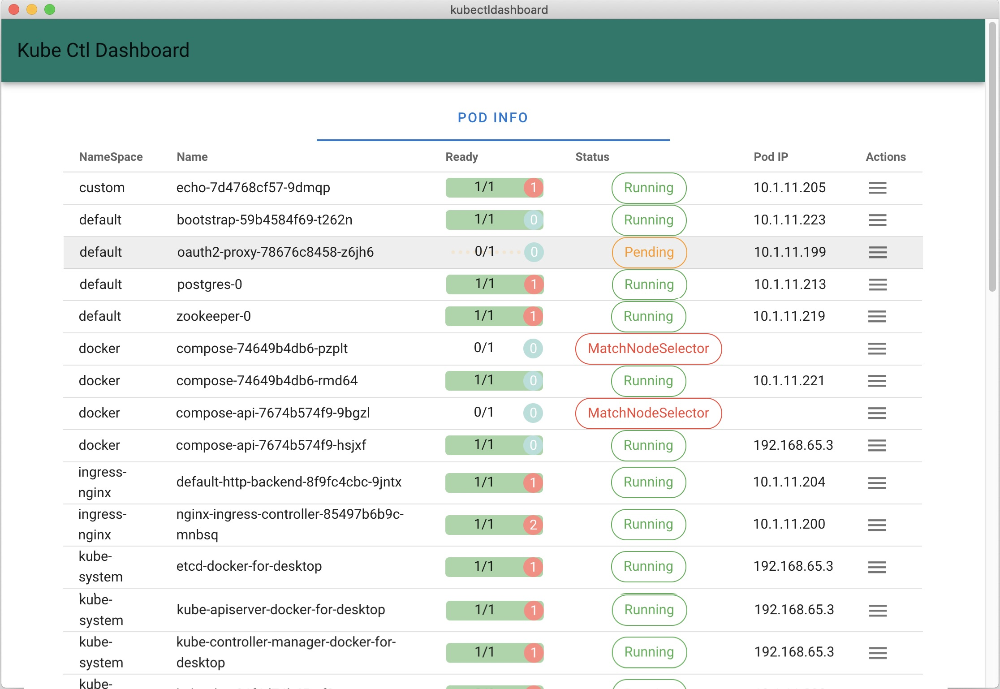
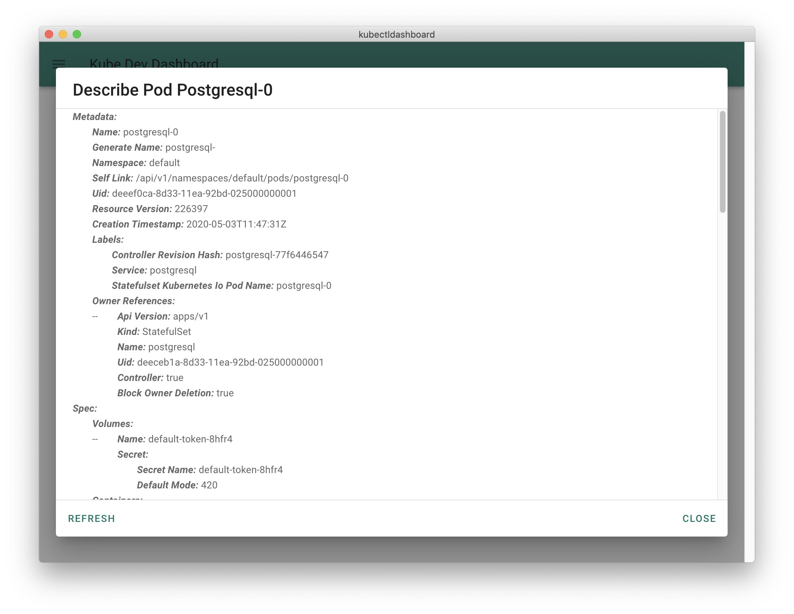
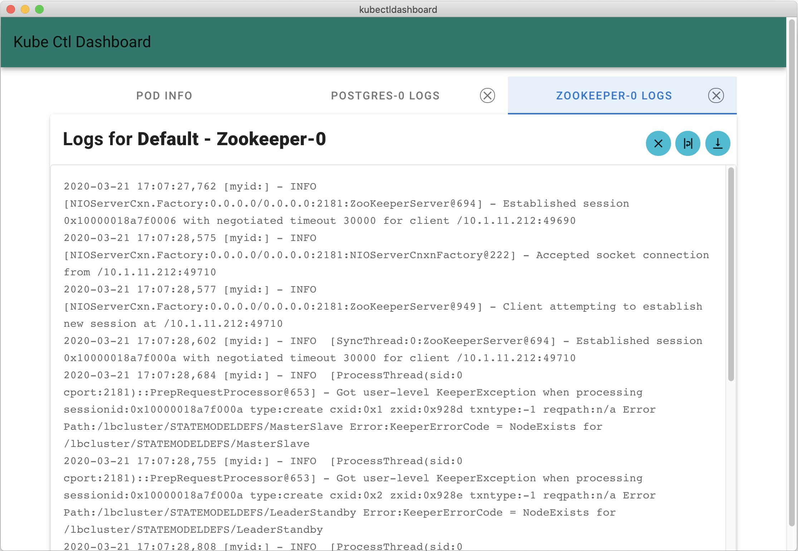

# Kube Dev Dashboard
Desktop Client for Kubernetes for Developers

Monitor your kubernetes setup and perform actions right from a single window, easily.

### Features :
- Monitor the running pods
- Get pod details like Pod IP, number of containers running, etc
- View logs of pod containers
- Describe Pod Details
.. many more coming soon

## Pod Info
- Get Pod Info like Status, IP, Ready Containers
- View and apply additional actions 
- View Pod Details

Pod Info

Describe Pod

## Logs
- View pod logs from any container
- Search within the logs

