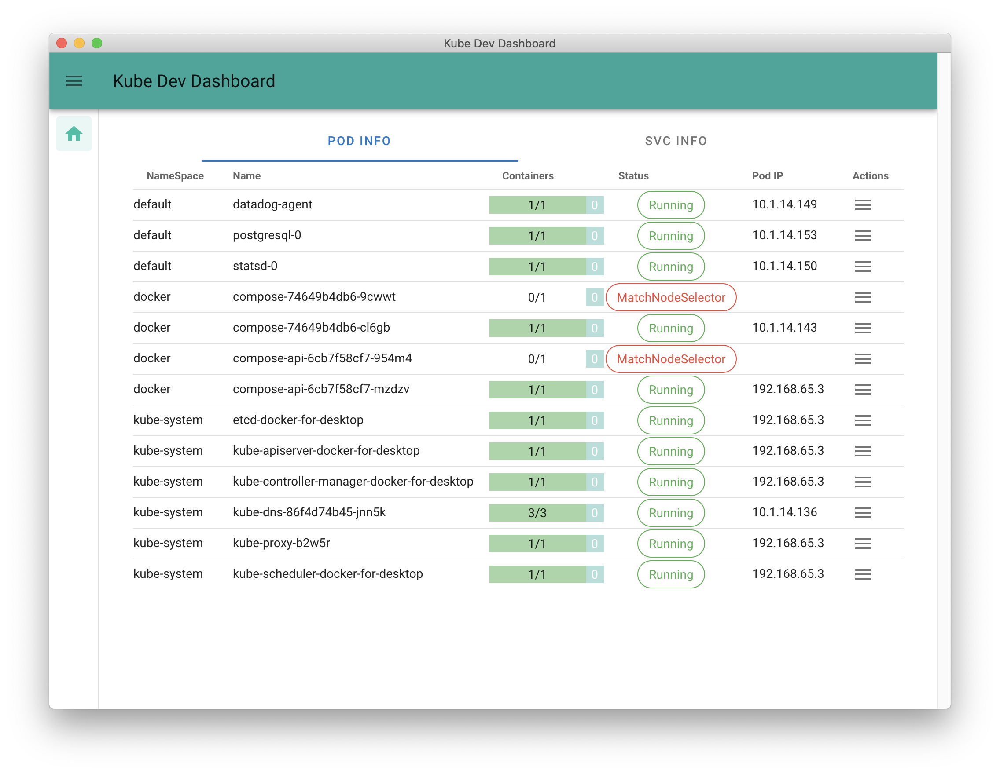
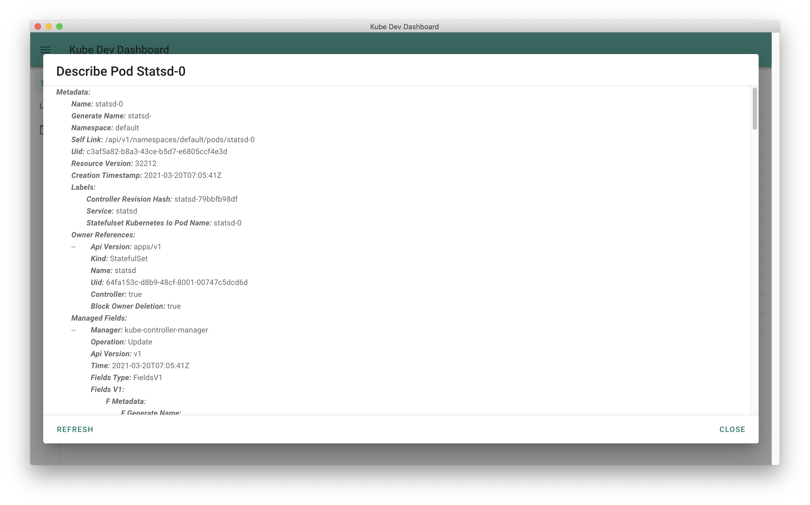
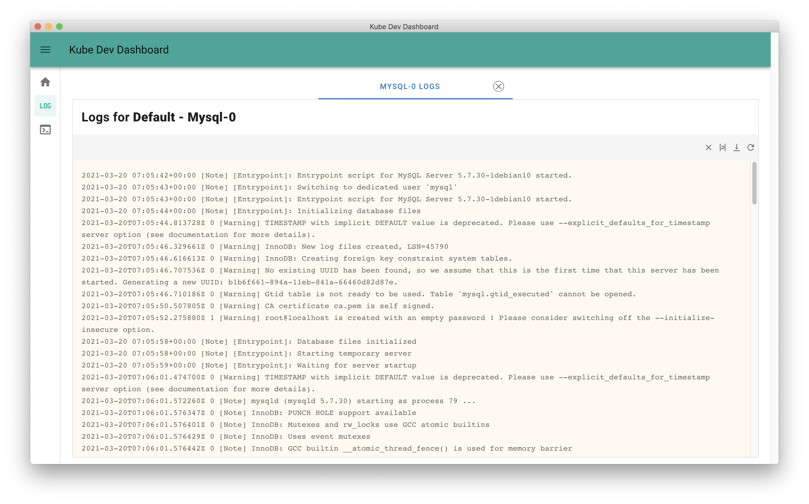

# Kube Dev Dashboard
Desktop Client for Kubernetes for Developers

Monitor your kubernetes setup/environment and perform actions right from a single window, easily.

### Features :
- Monitor the running pods
- Get pod details like Pod IP, number of containers running, etc
- Login to pod console
- Run commands inside a pod console
- View running services
- View logs of pod containers
- Describe Pod Details
- Describe Services Details
- Access a services with a single click
- .. many more coming soon

## Pod Info
- Get Pod Info like Status, IP, Ready Containers
- View and apply additional actions 
- View Pod Details
- Delete any Pod

Pod Info

Describe Pod

##  Services 
- Get current running Services and its details
- View Service Details
- One Click access to service with NodePort

Service Info

## Logs
- View pod logs
- Switch between containers when multi-container pod
- Search within the logs

## Consoles
- Open console terminal for a pod
- Run commands and interact with the pod terminal

Many more coming soon ...